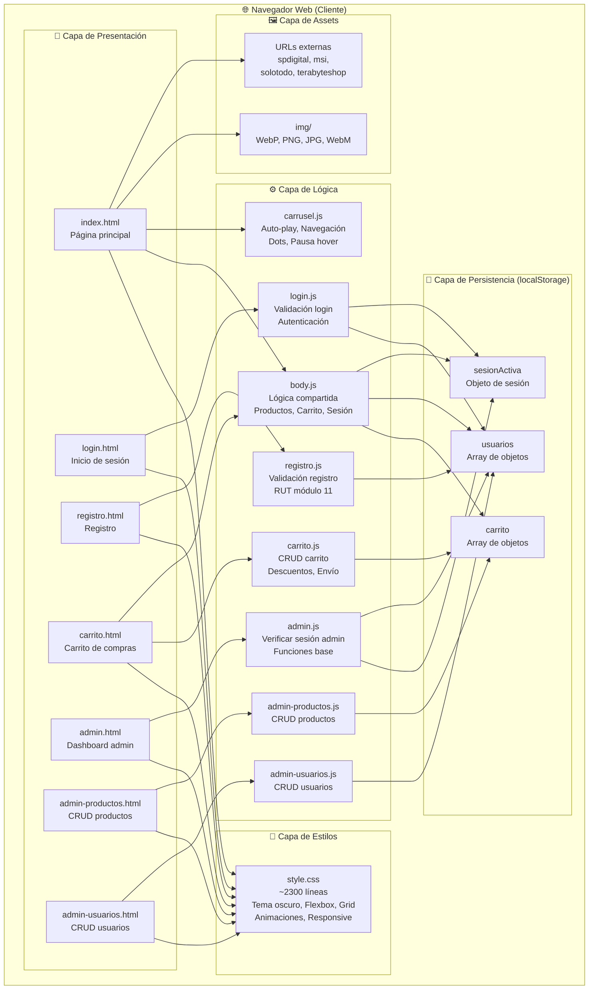
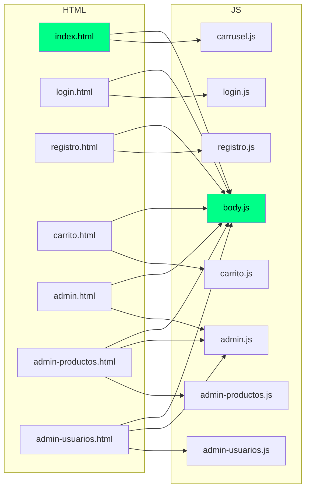
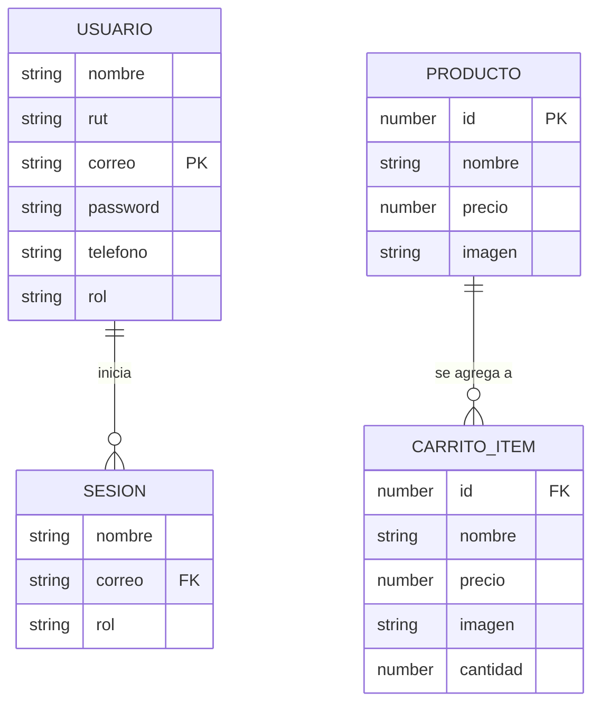

# Diagrama de Arquitectura — AkumaTech Tienda Gamer

Organización técnica, capas y relaciones entre los archivos del proyecto.

---

## Arquitectura general del proyecto



---

## Capas del sistema

### 1. Capa de Presentación (HTML)

Archivos `.html` que definen la estructura de cada página. No contienen lógica, solo marcado semántico, formularios y enlaces a CSS/JS.

| Archivo | Rol | Secciones principales |
|---------|-----|----------------------|
| `index.html` | Página de inicio | Header, nav, carrusel, productos destacados, footer |
| `login.html` | Autenticación | Formulario correo + contraseña |
| `registro.html` | Registro | Formulario multi-campo con validación |
| `carrito.html` | Compra | Lista de productos, controles de cantidad, resumen |
| `admin.html` | Dashboard admin | Estadísticas, enlaces a gestión |
| `admin-productos.html` | CRUD productos | Tabla de productos, formulario de creación/edición |
| `admin-usuarios.html` | CRUD usuarios | Tabla de usuarios, edición de roles |

### 2. Capa de Estilos (CSS)

Un único archivo `style.css` con toda la estilización del sitio:

| Sección | Contenido |
|---------|-----------|
| Configuración global | Reset `*`, tipografía, colores base, tema oscuro `#0f0f0f` |
| Header/Nav | Barra de navegación flex, logo con video, menú responsive |
| Carrusel | Slides absolutos, transición opacity, overlay con gradiente, dots, flechas |
| Productos | Grid responsivo de tarjetas, hover effects, botones con sombra verde |
| Formularios | Inputs estilizados, validación visual, mensajes de error |
| Carrito | Layout de lista + resumen lateral, controles de cantidad |
| Admin | Dashboard grid, sidebar, tablas de datos |
| Animaciones | `@keyframes neonGlow`, `fadeIn`, `pulse` |
| Responsive | `@media (max-width: 768px)` y `(max-width: 480px)` |

### 3. Capa de Lógica (JavaScript)

Archivos `.js` que manejan toda la interactividad. Sin frameworks, vanilla JavaScript puro.

| Archivo | Dependencias | Responsabilidad |
|---------|-------------|-----------------|
| `body.js` | Ninguna | Catálogo de productos, carrito base, gestión de sesión, creación de admin |
| `carrusel.js` | Ninguna | Auto-play del carrusel, navegación, pausa al hover |
| `login.js` | `body.js` (sesión) | Validación de formulario, autenticación contra localStorage |
| `registro.js` | Ninguna | Validación multi-campo, algoritmo RUT módulo 11, validación teléfono |
| `carrito.js` | `body.js` (carrito) | CRUD completo del carrito, descuentos, envío, finalización de compra |
| `admin.js` | `body.js` (sesión) | Verificación de permisos admin, funciones base del dashboard |
| `admin-productos.js` | `admin.js` | CRUD de productos desde panel admin |
| `admin-usuarios.js` | `admin.js` | CRUD de usuarios desde panel admin |

### 4. Capa de Persistencia (localStorage)

No hay backend ni base de datos. Toda la data persiste en el navegador:

```
localStorage
├── "usuarios"        → [{nombre, rut, correo, password, telefono, rol}, ...]
├── "sesionActiva"    → {nombre, correo, rol}
└── "carrito"         → [{id, nombre, precio, imagen, cantidad}, ...]
```

### 5. Capa de Assets

Recursos estáticos almacenados localmente en `img/`:

| Formato | Uso |
|---------|-----|
| `.webm` | Video animado del logo (cara akuma.webm) |
| `.webp` | Imágenes de productos optimizadas |
| `.png` | Imágenes de productos y logos |
| `.jpg` | Imágenes de carrusel (delivery.jpg, estacion-trabajo.png) |

Imágenes externas se cargan directamente desde URLs de retailers (spdigital.cl, msi.com, solotodo.com, terabyteshop.com).

---

## Relaciones entre archivos



---

## Modelo de datos



---

## Roles y permisos

```mermaid
flowchart TD
    subgraph ROLES
        VISITANTE["👤 Visitante<br/>(sin sesión)"]
        USUARIO["👤 Usuario<br/>(logueado)"]
        ADMIN_USER["🛡️ Administrador"]
    end

    VISITANTE -->|"Puede:"| V1["Ver productos"]
    VISITANTE --> V2["Agregar al carrito"]
    VISITANTE --> V3["Ver carrusel"]
    VISITANTE -->|"No puede:"| V4["Finalizar compra"]
    VISITANTE --> V5["Acceder al panel admin"]

    USUARIO -->|"Puede:"| U1["Todo lo del visitante"]
    USUARIO --> U2["Finalizar compra"]
    USUARIO --> U3["Aplicar descuentos"]
    USUARIO -->|"No puede:"| U4["Acceder al panel admin"]

    ADMIN_USER -->|"Puede:"| A1["Todo lo del usuario"]
    ADMIN_USER --> A2["Gestionar productos"]
    ADMIN_USER --> A3["Gestionar usuarios"]
    ADMIN_USER --> A4["Ver estadísticas"]
    ADMIN_USER --> A5["Eliminar usuarios"]
```


