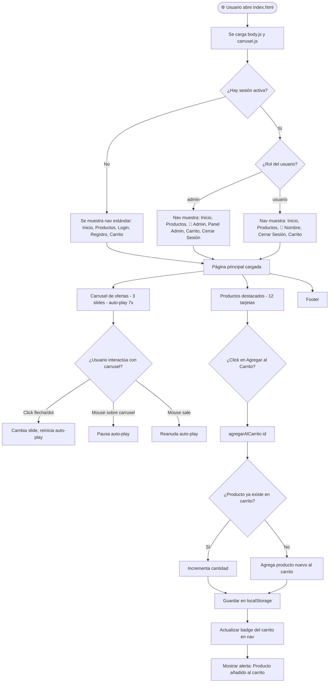
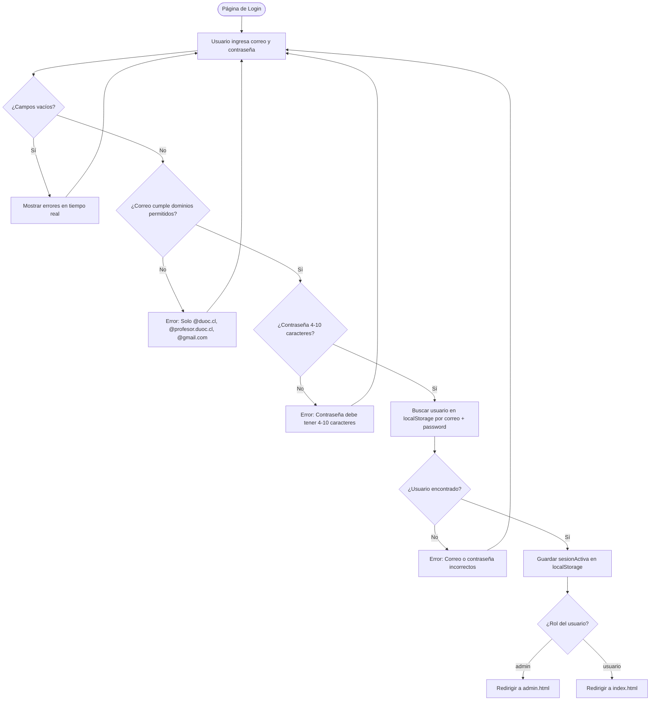
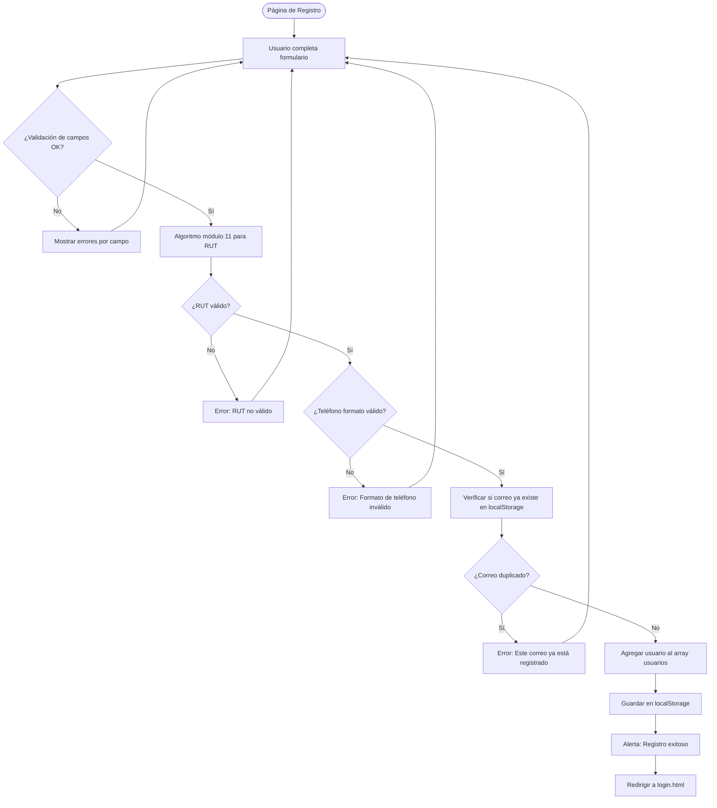
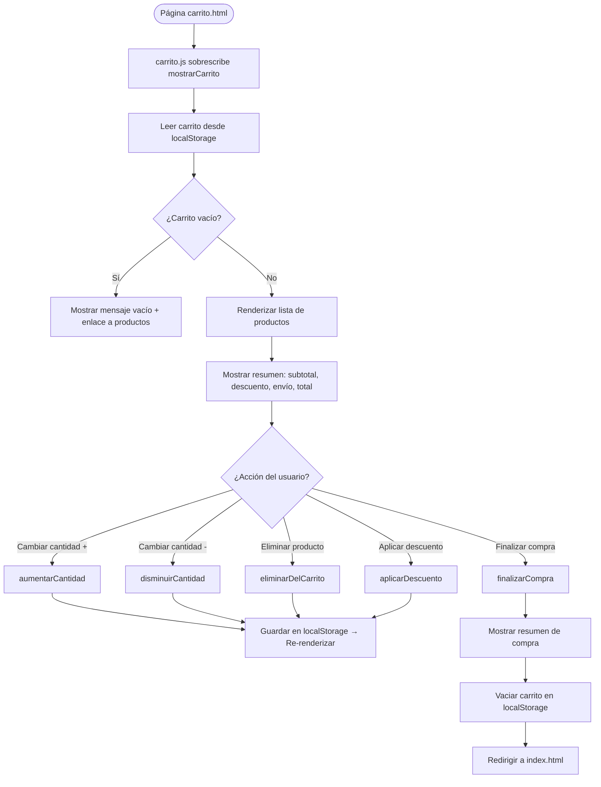
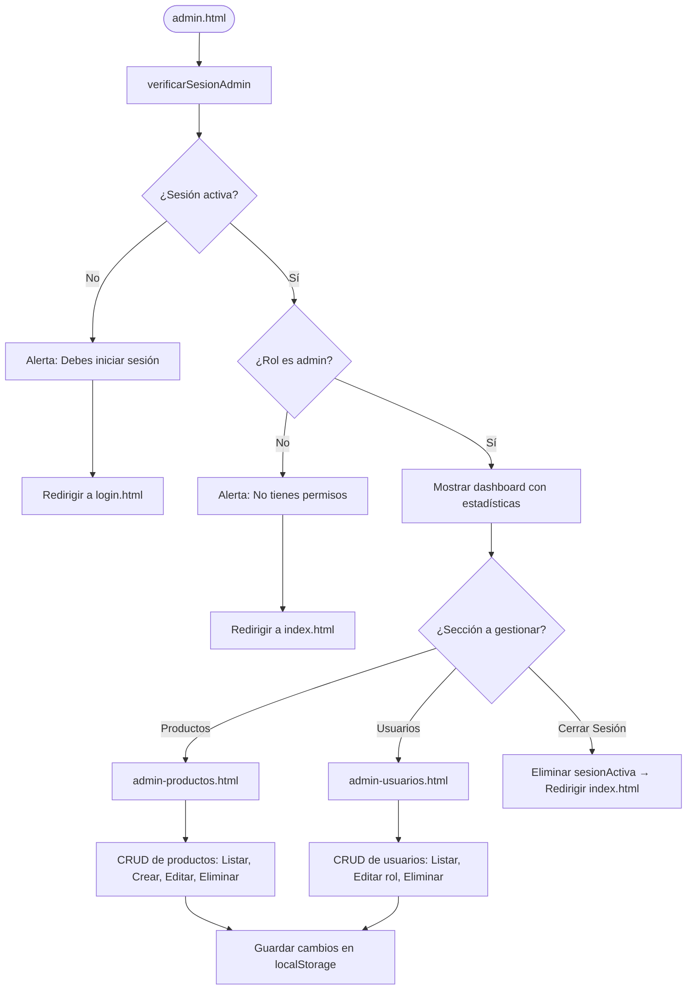
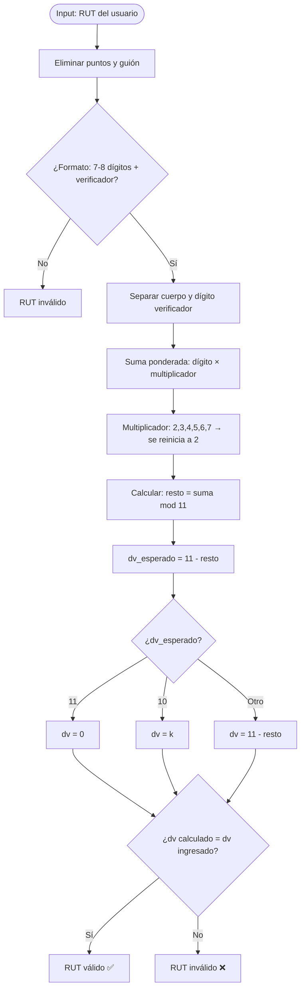

# Diagrama de Flujo — AkumaTech Tienda Gamer

Diagrama de flujo que describe la navegación del usuario y la lógica interna del sistema.

---

## Flujo principal de navegación

---

## Flujo de autenticación

---

## Flujo de registro

---

## Flujo del carrito de compras

---

## Flujo del panel de administración

---

## Validación de RUT chileno (Algoritmo Módulo 11)

